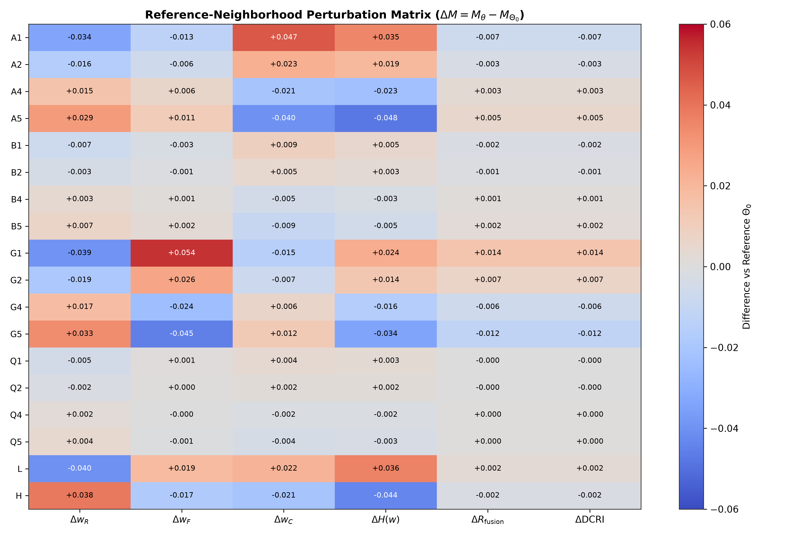

# Statistical Analysis & Reference-Neighborhood Inference

## 1. Reference-Neighborhood Difference Matrix ($\Delta M = M_\theta - M_{\Theta_0}$)

Every perturbed configuration $\Theta$ was compared against the frozen reference $\Theta_0 = (1.0, 1.5, 1.0, 0.5)$ across the paired cohort of $N=500$ decision packets.

---

## 2. Paired Bootstrap Inference ($B=1,000$ Resamples, $\text{Seed}=115$)

### Table 12.4: Paired Differences and 95% Bootstrap Confidence Intervals vs $\Theta_0$

| Config | Perturbation | Metric $\Delta M$ | Mean Difference | Median Difference | 95% Bootstrap CI | Excludes Zero? |
| :--- | :--- | :--- | :---: | :---: | :---: | :---: |
| **A1** | $\alpha = 0.50$ ($-50\%$) | $\Delta w_R$ | $-0.033702$ | $-0.041849$ | $[-0.036984, -0.030324]$ | **Yes** |
| | | $\Delta w_F$ | $-0.012870$ | $-0.008933$ | $[-0.015115, -0.010584]$ | **Yes** |
| | | $\Delta w_C$ | $+0.046572$ | $+0.052760$ | $[+0.044762, +0.048281]$ | **Yes** |
| | | $\Delta H$ | $+0.034990$ | $+0.039296$ | $[+0.032601, +0.037336]$ | **Yes** |
| | | $\Delta R_{\text{fusion}}$ | $-0.006860$ | $-0.003902$ | $[-0.008336, -0.005271]$ | **Yes** |
| **A5** | $\alpha = 1.50$ ($+50\%$) | $\Delta w_R$ | $+0.029270$ | $+0.035417$ | $[+0.026132, +0.032152]$ | **Yes** |
| | | $\Delta w_C$ | $-0.040070$ | $-0.043644$ | $[-0.041793, -0.038287]$ | **Yes** |
| | | $\Delta H$ | $-0.047780$ | $-0.050478$ | $[-0.050720, -0.044810]$ | **Yes** |
| **B1** | $\beta = 1.00$ ($-33\%$) | $\Delta w_R$ | $-0.007026$ | $-0.007204$ | $[-0.007284, -0.006764]$ | **Yes** |
| | | $\Delta w_C$ | $+0.009669$ | $+0.010008$ | $[+0.009315, +0.010017]$ | **Yes** |
| | | $\Delta H$ | $+0.005218$ | $+0.005118$ | $[+0.004886, +0.005545]$ | **Yes** |
| **B5** | $\beta = 2.00$ ($+33\%$) | $\Delta w_R$ | $+0.006244$ | $+0.006404$ | $[+0.006016, +0.006471]$ | **Yes** |
| | | $\Delta w_C$ | $-0.008545$ | $-0.008851$ | $[-0.008851, -0.008237]$ | **Yes** |
| **G1** | $\gamma = 0.50$ ($-50\%$) | $\Delta w_R$ | $-0.038940$ | $-0.043408$ | $[-0.039959, -0.037896]$ | **Yes** |
| | | $\Delta w_F$ | $+0.054154$ | $+0.058603$ | $[+0.052505, +0.055763]$ | **Yes** |
| | | $\Delta w_C$ | $-0.015214$ | $-0.013786$ | $[-0.015953, -0.014487]$ | **Yes** |
| | | $\Delta R_{\text{fusion}}$ | $+0.014308$ | $+0.014512$ | $[+0.012950, +0.015771]$ | **Yes** |
| **G5** | $\gamma = 1.50$ ($+50\%$) | $\Delta w_R$ | $+0.033343$ | $+0.036988$ | $[+0.032338, +0.034336]$ | **Yes** |
| | | $\Delta w_F$ | $-0.045257$ | $-0.048705$ | $[-0.046755, -0.043801]$ | **Yes** |
| | | $\Delta w_C$ | $+0.011914$ | $+0.010834$ | $[+0.011246, +0.012574]$ | **Yes** |
| | | $\Delta R_{\text{fusion}}$ | $-0.012012$ | $-0.012061$ | $[-0.013233, -0.010825]$ | **Yes** |
| **Q1** | $\eta = 0.25$ ($-50\%$) | $\Delta w_R$ | $-0.004475$ | $-0.004652$ | $[-0.004689, -0.004245]$ | **Yes** |
| | | $\Delta w_C$ | $+0.002871$ | $+0.003004$ | $[+0.002728, +0.003013]$ | **Yes** |
| **Q5** | $\eta = 0.75$ ($+50\%$) | $\Delta w_R$ | $+0.004524$ | $+0.004702$ | $[+0.004294, +0.004740]$ | **Yes** |
| | | $\Delta w_C$ | $-0.002949$ | $-0.003094$ | $[-0.003095, -0.002801]$ | **Yes** |
| **L** | Combined Low | $\Delta w_R$ | $-0.021025$ | $-0.024508$ | $[-0.023253, -0.018783]$ | **Yes** |
| | | $\Delta w_F$ | $+0.016335$ | $+0.018042$ | $[+0.014569, +0.018074]$ | **Yes** |
| | | $\Delta w_C$ | $+0.004690$ | $+0.005510$ | $[+0.003661, +0.005740]$ | **Yes** |
| **H** | Combined High | $\Delta w_R$ | $+0.020164$ | $+0.022986$ | $[+0.018018, +0.022285]$ | **Yes** |
| | | $\Delta w_F$ | $-0.014881$ | $-0.016147$ | $[-0.016474, -0.013243]$ | **Yes** |
| | | $\Delta w_C$ | $-0.005283$ | $-0.005898$ | $[-0.006275, -0.004273]$ | **Yes** |

---

## 3. Statistical Interpretation and Non-Superiority Principle

In a controlled benchmark with $N=500$ paired decision packets, high statistical precision causes even tiny parameter differences (e.g. $|\Delta w| \approx 0.004$) to yield 95% bootstrap confidence intervals that strictly exclude zero.

Crucially, **exclusion of zero indicates statistical consistency of directional sensitivity, not clinical or diagnostic superiority**. The purpose of these confidence intervals is to confirm that the observed directional routing responses are reproducible within the controlled experimental cohort.
