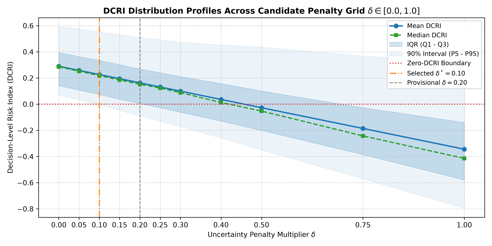
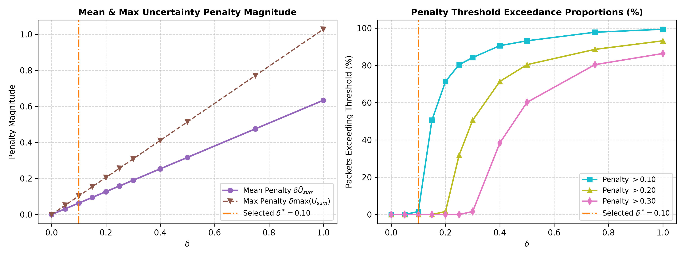

# Chapter 03 — Full Empirical Cohort Results

## 1. Primary Empirical Evaluation Table

Evaluated over the complete $N=500$ controlled decision cohort (seed 115) under reference router configuration $\Theta_0 = (1.0, 1.5, 1.0, 0.5)$:

| ID | $\delta$ | Mean DCRI $\pm$ SD | Median | IQR [Q1, Q3] | 90% Range [P5, P95] | Negative Rate | Mean Penalty $\overline{P}$ | Penalty / Base | Max Penalty |
| :--- | :---: | :---: | :---: | :---: | :---: | :---: | :---: | :---: | :---: |
| **D00** | $0.00$ | $0.289900 \pm 0.163635$ | $0.285888$ | $[0.141415, 0.393887]$ | $[0.071071, 0.591499]$ | $0.0\%$ (0/500) | $0.000000$ | $0.00\%$ | $0.000000$ |
| **D05** | $0.05$ | $0.258203 \pm 0.167822$ | $0.252120$ | $[0.107951, 0.363609]$ | $[0.031894, 0.576007]$ | $0.0\%$ (0/500) | $0.031697$ | $10.93\%$ | $0.051404$ |
| **D10** | **$0.10$** | **$0.226506 \pm 0.172786$** | **$0.218084$** | **$[0.073794, 0.334069]$** | **$[-0.005311, 0.550427]$** | **$7.4\%$ (37/500)** | **$0.063394$** | **$21.87\%$** | **$0.102808$** |
| **D15** | $0.15$ | $0.194809 \pm 0.178462$ | $0.185399$ | $[0.037598, 0.301813]$ | $[-0.046789, 0.533456]$ | $18.0\%$ (90/500) | $0.095090$ | $32.80\%$ | $0.154212$ |
| **D20** | $0.20$ | $0.163113 \pm 0.184783$ | $0.152374$ | $[0.004734, 0.268169]$ | $[-0.089832, 0.509923]$ | $24.4\%$ (122/500) | $0.126787$ | $43.73\%$ | $0.205616$ |
| **D25** | $0.25$ | $0.131416 \pm 0.191687$ | $0.123043$ | $[-0.027081, 0.241072]$ | $[-0.130381, 0.492629]$ | $28.8\%$ (144/500) | $0.158484$ | $54.67\%$ | $0.257020$ |
| **D30** | $0.30$ | $0.099719 \pm 0.199113$ | $0.088273$ | $[-0.061545, 0.210854]$ | $[-0.171750, 0.472920]$ | $35.0\%$ (175/500) | $0.190181$ | $65.60\%$ | $0.308423$ |
| **D40** | $0.40$ | $0.036325 \pm 0.215311$ | $0.013001$ | $[-0.129790, 0.157414]$ | $[-0.258421, 0.453075]$ | $46.8\%$ (234/500) | $0.253574$ | $87.47\%$ | $0.411231$ |
| **D50** | $0.50$ | $-0.027068 \pm 0.232986$ | $-0.052752$ | $[-0.200275, 0.100960]$ | $[-0.349101, 0.436652]$ | $61.6\%$ (308/500) | $0.316968$ | $109.34\%$ | $0.514039$ |
| **D75** | $0.75$ | $-0.185552 \pm 0.281765$ | $-0.242508$ | $[-0.385338, -0.027389]$ | $[-0.569538, 0.367985]$ | $77.2\%$ (386/500) | $0.475452$ | $164.01\%$ | $0.771059$ |
| **D100** | $1.00$ | $-0.344036 \pm 0.334770$ | $-0.414389$ | $[-0.579372, -0.139528]$ | $[-0.795445, 0.328107]$ | $82.6\%$ (413/500) | $0.633936$ | $218.67\%$ | $1.028078$ |

### Figure 1: DCRI Score Distributions Across Candidate Grid ($\delta \in [0.0, 1.0]$)

---

## 2. Penalty Magnitude Dynamics & Threshold Exceedance

Because the penalty term $\Delta \text{DCRI}_\delta = -\delta U_{\text{sum}}$ scales directly with aggregate modality uncertainty, we examine the proportion of packets where the uncertainty penalty exceeds operational clinical relevance thresholds:

| ID | $\delta$ | Penalty $> 0.10$ | Penalty $> 0.20$ | Penalty $> 0.30$ | Maximum Observed Penalty |
| :--- | :---: | :---: | :---: | :---: | :---: |
| **D00** | $0.00$ | $0.0\%$ (0) | $0.0\%$ (0) | $0.0\%$ (0) | $0.000000$ |
| **D05** | $0.05$ | $0.0\%$ (0) | $0.0\%$ (0) | $0.0\%$ (0) | $0.051404$ |
| **D10** | **$0.10$** | **$1.6\%$ (8)** | **$0.0\%$ (0)** | **$0.0\%$ (0)** | **$0.102808$** |
| **D15** | $0.15$ | $50.6\%$ (253) | $0.0\%$ (0) | $0.0\%$ (0) | $0.154212$ |
| **D20** | $0.20$ | $71.4\%$ (357) | $1.6\%$ (8) | $0.0\%$ (0) | $0.205616$ |
| **D25** | $0.25$ | $80.4\%$ (402) | $31.8\%$ (159) | $0.0\%$ (0) | $0.257020$ |
| **D30** | $0.30$ | $84.2\%$ (421) | $50.6\%$ (253) | $1.6\%$ (8) | $0.308423$ |
| **D40** | $0.40$ | $90.6\%$ (453) | $71.4\%$ (357) | $38.4\%$ (192) | $0.411231$ |
| **D50** | $0.50$ | $93.2\%$ (466) | $80.4\%$ (402) | $60.2\%$ (301) | $0.514039$ |
| **D75** | $0.75$ | $97.8\%$ (489) | $88.6\%$ (443) | $80.4\%$ (402) | $0.771059$ |
| **D100** | $1.00$ | $99.4\%$ (497) | $93.2\%$ (466) | $86.4\%$ (432) | $1.028078$ |

### Figure 2: Uncertainty Penalty Scaling & Threshold Exceedance Proportions

### Key Diagnostic Observations:
- **$\delta = 0.10$ Threshold Containment**: At $\delta = 0.10$, only $1.6\%$ of encounters experience a penalty exceeding $0.10$, ensuring that uncertainty acts as a measured discount rather than completely overwhelming the underlying risk evidence.
- **$\delta = 0.20$ Penalty Escalation**: At the historical $\delta = 0.20$, over **$71.4\%$** of packets receive a penalty $> 0.10$, creating heavy compression across the lower risk quartiles.
