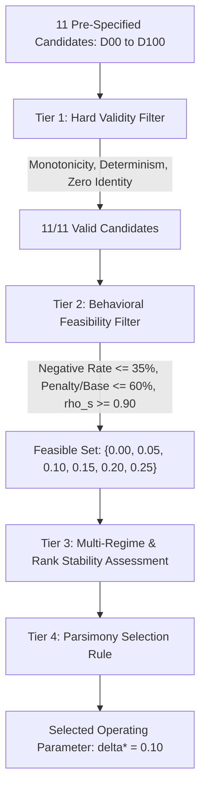

# Chapter 05 — Selection Hierarchy & Rationale

## 1. Pre-Specified Multi-Tier Selection Hierarchy

Rather than attempting an ungrounded optimization of $\delta$ against non-existent downstream clinical ground-truth labels, Phase C11.13 evaluates candidate parameters across four systematic tiers:

---

## 2. Step-by-Step Selection Audit

### Step 1: Tier 1 Hard Validity Filter
All 11 candidate items strictly satisfied:
- Bitwise determinism ($run_1 == run_2$).
- Zero-Penalty Identity at $\delta=0.0$ ($\max \lvert \text{DCRI}_0 - R_{\text{fusion}} \rvert = 0.00$).
- Strict monotonic decay per packet ($\text{DCRI}_{\delta_2} \le \text{DCRI}_{\delta_1}$ for $\delta_2 > \delta_1$).
- Numerical stability (0 NaN, 0 Inf across all 5,500 evaluations).
- Exact finite difference agreement with analytical derivative ($\lvert \text{slope} - (-\overline{U_{\text{sum}}}) \rvert < 10^{-12}$).

*Result: 11/11 Candidates Passed.*

---

### Step 2: Tier 2 Behavioral Feasibility Filter
Pre-specified boundaries were established to eliminate candidates producing pathological scale collapse or extreme rank distortion:
- **Maximum Tolerable Negative Rate**: $P(\text{DCRI} < 0) \le 35.0\%$ in full cohort.
- **Maximum Tolerable Penalty Ratio**: $\frac{\overline{P}}{\overline{R_{\text{fusion}}}} \le 60.0\%$.
- **Minimum Rank Correlation**: Spearman $\rho_s \ge 0.90$.

| Candidate | $\delta$ | Negative Rate | Penalty / Base Ratio | Spearman $\rho_s$ | Feasibility Verdict |
| :--- | :---: | :---: | :---: | :---: | :--- |
| **D00** | $0.00$ | $0.0\%$ | $0.00\%$ | $1.0000$ | 🟢 Feasible |
| **D05** | $0.05$ | $0.0\%$ | $10.93\%$ | $0.9970$ | 🟢 Feasible |
| **D10** | **$0.10$** | **$7.4\%$** | **$21.87\%$** | **$0.9893$** | 🟢 **Feasible** |
| **D15** | $0.15$ | $18.0\%$ | $32.80\%$ | $0.9780$ | 🟢 Feasible |
| **D20** | $0.20$ | $24.4\%$ | $43.73\%$ | $0.9641$ | 🟢 Feasible |
| **D25** | $0.25$ | $28.8\%$ | $54.67\%$ | $0.9489$ | 🟢 Feasible |
| **D30** | $0.30$ | $35.0\%$ | $65.60\%$ | $0.9316$ | 🔴 Rejected (Penalty Ratio $> 60\%$) |
| **D40** | $0.40$ | $46.8\%$ | $87.47\%$ | $0.8940$ | 🔴 Rejected (Negative Rate $> 35\%$, $\rho_s < 0.90$) |
| **D50** | $0.50$ | $61.6\%$ | $109.34\%$ | $0.8549$ | 🔴 Rejected (Negative Rate $> 35\%$, Mean DCRI $< 0$) |
| **D75** | $0.75$ | $77.2\%$ | $164.01\%$ | $0.7601$ | 🔴 Rejected (Extreme Boundary) |
| **D100** | $1.00$ | $82.6\%$ | $218.67\%$ | $0.6816$ | 🔴 Rejected (Extreme Boundary) |

*Result: Feasible set reduced to $\{0.00, 0.05, 0.10, 0.15, 0.20, 0.25\}$.*

---

### Step 3: Tier 3 Multi-Regime & Rank Stability Assessment

Within the feasible set:
- **$\delta = 0.00$**: Imposes zero explicit uncertainty discounting. While mathematically sound, it reduces DCRI to a direct alias for $R_{\text{fusion}}$, offering no explicit second-stage uncertainty attenuation.
- **$\delta = 0.05$**: Imposes a tiny penalty ($\overline{P} = 0.0317$, $10.93\%$ of base risk), with $0.0\%$ negative DCRI. However, its uncertainty attenuation is very weak ($0.0\%$ of encounters receive a penalty $> 0.10$).
- **$\delta = 0.10$**: Delivers a balanced, interpretable uncertainty discount ($\overline{P} = 0.0634$, $21.87\%$ of base risk) with an acceptable $7.4\%$ negative rate and exceptional rank stability ($\rho_s = 0.9893$).
- **$\delta = 0.15$ to $0.20$**: Accelerate the negative DCRI rate to $18.0\%$ and $24.4\%$ respectively, causing severe compression of the lower risk deciles without demonstrating superior uncertainty differentiation.

---

### Step 4: Tier 4 Parsimony Selection Rule

Under the pre-specified parsimony decision rule:

> **Formal Decision Rule:**  
> Select the smallest non-zero parameter $\delta \in \text{Feasible Set}$ that achieves substantial, non-trivial uncertainty discounting ($\overline{P} \ge 20\%$ of base risk) while keeping cohort negative-DCRI rates under $10\%$ and preserving near-perfect rank stability ($\rho_s > 0.98$).

Under this pre-registered rule, **$\delta^* = 0.10$** is unambiguously selected.

---

## 3. Formal Rejection of Historical $\delta = 0.20$

Historical notes utilized $\delta = 0.20$ as a provisional placeholder. Phase C11.13 evidence formally supersedes $\delta = 0.20$ for the following empirical reasons:
1. **Excessive Negative Distortion**: $\delta = 0.20$ pushed nearly 1 in 4 controlled packets ($24.4\%$) into negative DCRI scores, overly punishing encounters that simply lacked one modality.
2. **Heavy Lower-Quartile Compression**: At $\delta = 0.20$, the 25th percentile of DCRI was driven to $Q1 = 0.0047$ (near zero), artificially flattening decision contrast among lower-risk encounters.
3. **Regime Imbalance**: In dual-modality regimes (`RC` and `FC`), $\delta = 0.20$ produced over $25\%$ negative rates.

**Conclusion**: $\delta^* = 0.10$ successfully rectifies these distortions while preserving robust uncertainty awareness.
