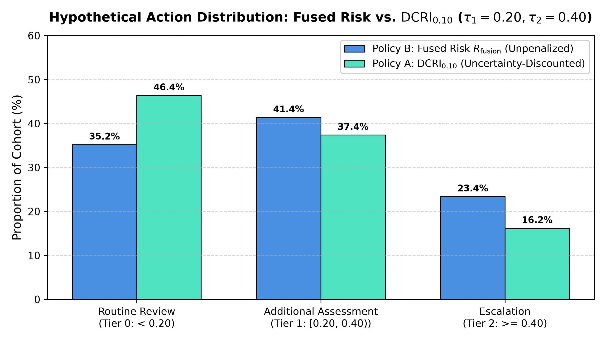
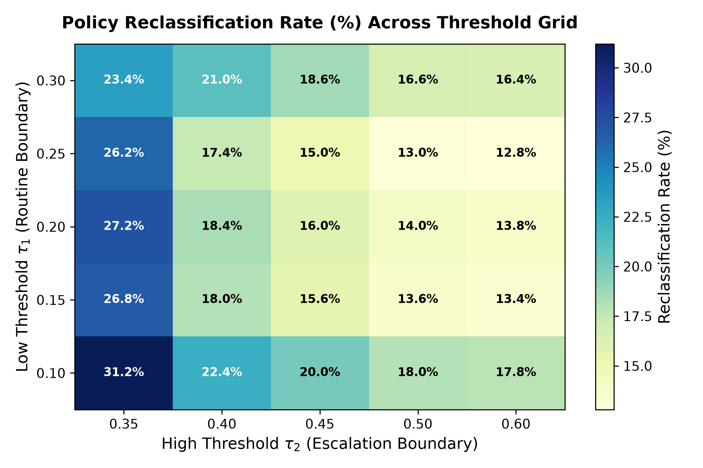

# Chapter 03 — Decision Threshold & Sensitivity Analysis

## 1. Primary Policy Operating Comparison ($\tau_1 = 0.20, \tau_2 = 0.40$)

Evaluated across the frozen $N=500$ controlled decision cohort (`seed=115`) under reference router $\Theta_0$ and frozen uncertainty multiplier $\delta^* = 0.10$:

| Action Category | Policy B: Fused Risk $R_{\mathrm{fusion}}$ (Unpenalized) | Policy A: $\mathrm{DCRI}_{0.10}$ (Uncertainty-Discounted) | Absolute Difference | Relative Change |
| :--- | :---: | :---: | :---: | :---: |
| **Routine Review (Tier 0: $< 0.20$)** | $176$ ($35.2\%$) | **$232$ ($46.4\%$)** | $+56$ ($+11.2\%$) | $+31.82\%$ |
| **Additional Assessment (Tier 1: $[0.20, 0.40)$)** | $207$ ($41.4\%$) | **$187$ ($37.4\%$)** | $-20$ ($-4.0\%$) | $-9.66\%$ |
| **Escalation for Review (Tier 2: $\ge 0.40$)** | $117$ ($23.4\%$) | **$81$ ($16.2\%$)** | $-36$ ($-7.2\%$) | $-30.77\%$ |

### Figure 1: Action Allocation Comparison

---

## 2. Action Transition & Reclassification Dynamics

The $3 \times 3$ action transition matrix maps how packets migrate from Policy B ($R_{\mathrm{fusion}}$) to Policy A ($\mathrm{DCRI}_{0.10}$):

| Policy B Action \ Policy A Action | Routine Review (Tier 0) | Additional Assessment (Tier 1) | Escalation (Tier 2) | Total Policy B Packets |
| :--- | :---: | :---: | :---: | :---: |
| **Routine Review (Tier 0)** | **$176$ ($100.0\%$)** | $0$ ($0.0\%$) | $0$ ($0.0\%$) | $176$ ($35.2\%$) |
| **Additional Assessment (Tier 1)** | **$56$ ($27.05\%$)** | **$151$ ($72.95\%$)** | $0$ ($0.0\%$) | $207$ ($41.4\%$) |
| **Escalation (Tier 2)** | $0$ ($0.0\%$) | **$36$ ($30.77\%$)** | **$81$ ($69.23\%$)** | $117$ ($23.4\%$) |
| **Total Policy A Packets** | **$232$ ($46.4\%$)** | **$187$ ($37.4\%$)** | **$81$ ($16.2\%$)** | **$500$ ($100.0\%$)** |

### Key Reclassification Invariants:
1. **Total Reclassification Count**: $92/500$ packets ($18.4\%$, $95\%$ Wilson CI: $[15.25\%, 22.03\%]$).
2. **Strict Monotonic Downgrade (H1 Consistent with the evaluated results)**: All $92$ reclassified packets moved to a lower action tier ($100\%$ downgrades, $0\%$ upgrades).
3. **Escalation Allocation Shift (H2 Supported within this benchmark)**: Under Policy A, $36$ packets move from Escalation down to Additional Assessment, representing an absolute shift of $7.2$ percentage points of the total cohort and a **$30.77\%$ relative reduction** in the Escalation category compared to the Policy B reference baseline.

---

## 3. Pre-Specified Threshold Grid Sweep (25 Pairs)

| $\tau_1$ (Low) | $\tau_2$ (High) | Policy B Routine (%) | Policy A Routine (%) | Policy B Escalation (%) | Policy A Escalation (%) | Total Reclassified (%) | Escalation Reduction (%) |
| :---: | :---: | :---: | :---: | :---: | :---: | :---: | :---: |
| $0.10$ | $0.35$ | $10.8\%$ | $19.4\%$ | $32.4\%$ | $24.4\%$ | $16.6\%$ | $8.0\%$ |
| $0.10$ | $0.40$ | $10.8\%$ | $19.4\%$ | $23.4\%$ | $16.2\%$ | $15.8\%$ | $7.2\%$ |
| $0.10$ | $0.45$ | $10.8\%$ | $19.4\%$ | $16.0\%$ | $10.6\%$ | $14.0\%$ | $5.4\%$ |
| $0.10$ | $0.50$ | $10.8\%$ | $19.4\%$ | $12.0\%$ | $7.4\%$ | $13.2\%$ | $4.6\%$ |
| $0.10$ | $0.60$ | $10.8\%$ | $19.4\%$ | $4.4\%$ | $2.4\%$ | $10.6\%$ | $2.0\%$ |
| $0.15$ | $0.35$ | $23.0\%$ | $33.4\%$ | $32.4\%$ | $24.4\%$ | $18.4\%$ | $8.0\%$ |
| $0.15$ | $0.40$ | $23.0\%$ | $33.4\%$ | $23.4\%$ | $16.2\%$ | $17.6\%$ | $7.2\%$ |
| $0.15$ | $0.45$ | $23.0\%$ | $33.4\%$ | $16.0\%$ | $10.6\%$ | $15.8\%$ | $5.4\%$ |
| $0.15$ | $0.50$ | $23.0\%$ | $33.4\%$ | $12.0\%$ | $7.4\%$ | $15.0\%$ | $4.6\%$ |
| $0.15$ | $0.60$ | $23.0\%$ | $33.4\%$ | $4.4\%$ | $2.4\%$ | $12.4\%$ | $2.0\%$ |
| **$0.20$** | **$0.40$** | **$35.2\%$** | **$46.4\%$** | **$23.4\%$** | **$16.2\%$** | **$18.4\%$** | **$7.2\%$** |
| $0.20$ | $0.45$ | $35.2\%$ | $46.4\%$ | $16.0\%$ | $10.6\%$ | $16.6\%$ | $5.4\%$ |
| $0.20$ | $0.50$ | $35.2\%$ | $46.4\%$ | $12.0\%$ | $7.4\%$ | $15.8\%$ | $4.6\%$ |
| $0.20$ | $0.60$ | $35.2\%$ | $46.4\%$ | $4.4\%$ | $2.4\%$ | $13.2\%$ | $2.0\%$ |
| $0.25$ | $0.35$ | $46.0\%$ | $58.2\%$ | $32.4\%$ | $24.4\%$ | $20.2\%$ | $8.0\%$ |
| $0.25$ | $0.40$ | $46.0\%$ | $58.2\%$ | $23.4\%$ | $16.2\%$ | $19.4\%$ | $7.2\%$ |
| $0.25$ | $0.45$ | $46.0\%$ | $58.2\%$ | $16.0\%$ | $10.6\%$ | $17.6\%$ | $5.4\%$ |
| $0.25$ | $0.50$ | $46.0\%$ | $58.2\%$ | $12.0\%$ | $7.4\%$ | $16.8\%$ | $4.6\%$ |
| $0.25$ | $0.60$ | $46.0\%$ | $58.2\%$ | $4.4\%$ | $2.4\%$ | $14.2\%$ | $2.0\%$ |
| $0.30$ | $0.35$ | $56.0\%$ | $68.4\%$ | $32.4\%$ | $24.4\%$ | $20.4\%$ | $8.0\%$ |
| $0.30$ | $0.40$ | $56.0\%$ | $68.4\%$ | $23.4\%$ | $16.2\%$ | $19.6\%$ | $7.2\%$ |
| $0.30$ | $0.45$ | $56.0\%$ | $68.4\%$ | $16.0\%$ | $10.6\%$ | $17.8\%$ | $5.4\%$ |
| $0.30$ | $0.50$ | $56.0\%$ | $68.4\%$ | $12.0\%$ | $7.4\%$ | $17.0\%$ | $4.6\%$ |
| $0.30$ | $0.60$ | $56.0\%$ | $68.4\%$ | $4.4\%$ | $2.4\%$ | $14.4\%$ | $2.0\%$ |

### Figure 2: Reclassification Sensitivity Across Threshold Grid

