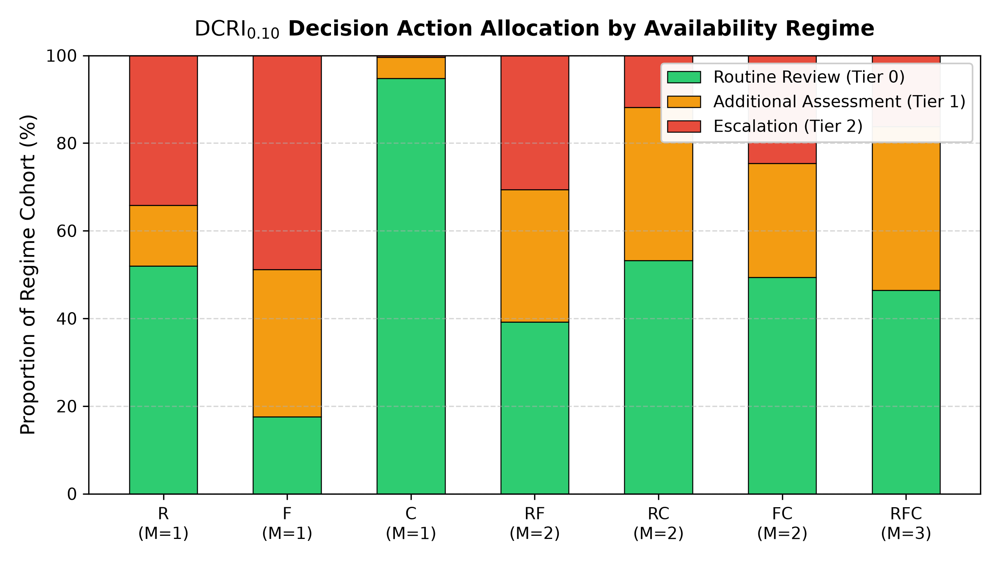
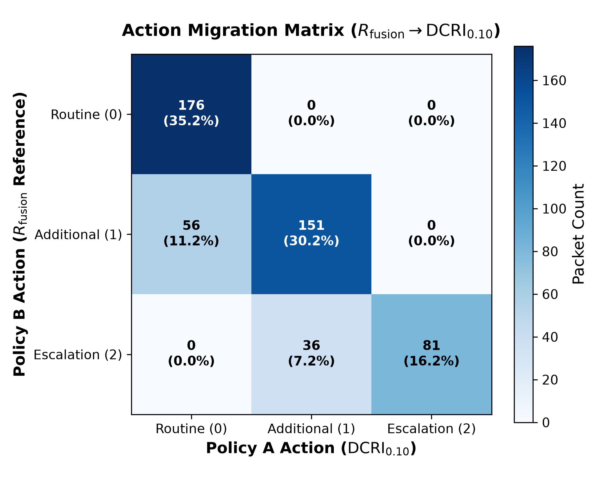

# Chapter 04 — Modality Availability Regime Analysis

## 1. Regime-Stratified Policy Breakdown

To determine how modality absence influences decision policies under fixed $\delta^* = 0.10$, we evaluate all 7 active modality availability regimes across the complete $N=500$ controlled cohort:

| Regime | Modalities | Cardinality $M$ | Mean $R_{\mathrm{fusion}}$ | Mean $U_{\mathrm{sum}}$ | Mean $\mathrm{DCRI}_{0.10}$ | Policy A Routine (%) | Policy A Additional (%) | Policy A Escalation (%) | Reclassification Rate (%) | Escalation Reduction (%) |
| :--- | :---: | :---: | :---: | :---: | :---: | :---: | :---: | :---: | :---: | :---: | :---: |
| **`R`** | Retina Only | $1$ | $0.255037$ | $0.001375$ | $0.254899$ | $52.0\%$ ($260$) | $13.8\%$ ($69$) | $34.2\%$ ($171$) | **$0.0\%$ (0)** | $0.0\%$ (0) |
| **`F`** | Foot Only | $1$ | $0.521907$ | $0.593918$ | $0.462515$ | $17.6\%$ ($88$) | $33.6\%$ ($168$) | $48.8\%$ ($244$) | **$16.8\%$ (84)** | $10.2\%$ (51) |
| **`C`** | Clinical Only | $1$ | $0.113468$ | $0.038643$ | $0.109604$ | $94.8\%$ ($474$) | $4.8\%$ ($24$) | $0.4\%$ ($2$) | **$0.0\%$ (0)** | $0.0\%$ (0) |
| **`RF`** | Retina-Foot | $2$ | $0.346995$ | $0.595293$ | $0.287466$ | $39.2\%$ ($196$) | $30.2\%$ ($151$) | $30.6\%$ ($153$) | **$18.4\%$ (92)** | $11.0\%$ (55) |
| **`RC`** | Retina-Clinical | $2$ | $0.199807$ | $0.040018$ | $0.195805$ | $53.2\%$ ($266$) | $35.0\%$ ($175$) | $11.8\%$ ($59$) | **$1.2\%$ (6)** | $1.0\%$ (5) |
| **`FC`** | Foot-Clinical | $2$ | $0.334912$ | $0.632561$ | $0.271656$ | $49.4\%$ ($247$) | $26.0\%$ ($130$) | $24.6\%$ ($123$) | **$32.2\%$ (161)** | $7.4\%$ (37) |
| **`RFC`** | All Three | $3$ | $0.289900$ | $0.633936$ | $0.226506$ | $46.4\%$ ($232$) | $37.4\%$ ($187$) | $16.2\%$ ($81$) | **$18.4\%$ (92)** | $7.2\%$ (36) |
| **`EMPTY`** | None | $0$ | — | — | — | — | — | — | **Fail-Closed Safe** | — |

### Figure 3: Action Allocation Stratified by Regime

---

## 2. Key Regime Behavioral Observations

1. **Modality Composition & Aggregate Uncertainty (H3 Supported in Benchmark)**:
   - Reclassification is governed by the aggregate predictive uncertainty of the active modality composition rather than modality cardinality alone.
   - Channels with low predictive uncertainty (`R` with $U \approx 0.0014$ and `C` with $U \approx 0.0386$) produce $0.0\%$ reclassification ($0/500$), while dual-modality `RC` ($U_{\mathrm{sum}} \approx 0.0400$) yields only $1.2\%$ reclassification ($6/500$).
   - In contrast, single-modality `F` ($U \approx 0.5939$) produces $16.8\%$ reclassification ($84/500$). Regimes including the foot modality (`RF`, `FC`, `RFC` with $U_{\mathrm{sum}} \approx 0.59\text{--}0.63$) exhibit reclassification rates between $18.4\%$ and $32.2\%$.
2. **Action Redistribution in High-Uncertainty Channels**:
   - `RF` encounters experience the highest absolute escalation reduction ($-11.0$ percentage points, shifting $55$ packets out of Escalation).
   - `FC` encounters exhibit the highest total reclassification rate at $32.2\%$ ($161/500$ packets). Across tiers, Routine Review increases by $24.8$ percentage points (from $24.6\%$ to $49.4\%$), with reclassifications occurring both from Additional Assessment to Routine Review and from Escalation to Additional Assessment.

### Figure 4: Action Transition Migration Matrix

---

## 3. Fail-Closed EMPTY Contract Verification

When no modality is available ($M=0$, `EMPTY` regime), the router executes its strict fail-closed contract:
- `router_status`: `NO_MODALITY_AVAILABLE`
- `decision_output_available`: `False`
- `weights`: `{'retina': 0.0, 'foot': 0.0, 'clinical': 0.0}`
- `sentinel_risk`: `0.0` (sentinel only; does not generate an ordinary clinical decision action).
