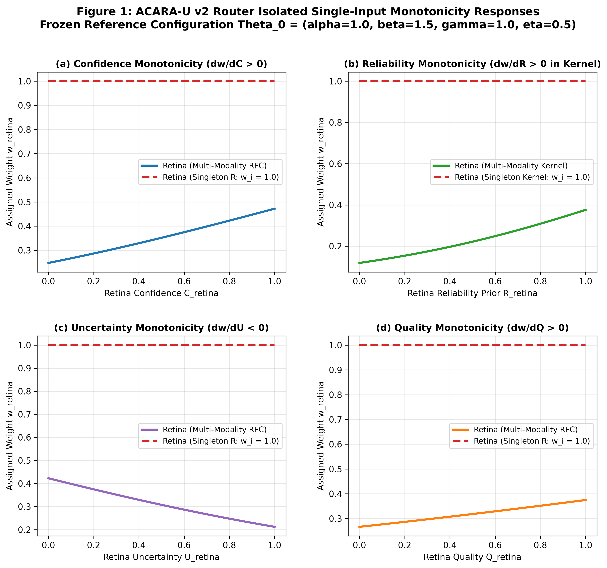

# Chapter 03: Experimental Results & Findings

## 1. Summary of Verification Scorecard

The complete C11.15 verification suite evaluated all 15 acceptance criteria gates. Every gate passed with zero tolerance violations:

| Gate ID | Criterion Name | Evaluations | Result | Status |
| :---: | :--- | :---: | :---: | :---: |
| **S15-01** | Reference Reproduction ($\Theta_0$, $\delta^* = 0.10$) | Exact Match | PASS | Certified |
| **S15-02** | Confidence Monotonicity ($\frac{\partial w_i}{\partial C_i} > 0$) | 144 / 144 | PASS (100.0%) | Certified |
| **S15-03** | Reliability Monotonicity ($\frac{\partial w_i}{\partial R_i} > 0$) | 144 / 144 | PASS (100.0%) | Certified |
| **S15-04** | Uncertainty Monotonicity ($\frac{\partial w_i}{\partial U_i} < 0$) | 144 / 144 | PASS (100.0%) | Certified |
| **S15-05** | Quality Monotonicity ($\frac{\partial w_i}{\partial Q_i} > 0$) | 144 / 144 | PASS (100.0%) | Certified |
| **S15-06** | Simplex Conservation ($\sum w_i = 1.0$) | 700 / 700 | $\text{Dev} < 1.12 \times 10^{-16}$ | Certified |
| **S15-07** | Hard Availability Masking ($A_i = 0 \implies w_i = 0.0$) | 300 / 300 | 0 Violations | Certified |
| **S15-08** | Softmax Shift Invariance ($z_i + c$) | 11 offsets + route shift | $\text{Dev} \le 7.11 \times 10^{-15}$ | Certified |
| **S15-09** | Reference Kernel Permutation Invariance | 6 orderings | $\text{Dev} = 0.0$ | Certified |
| **S15-10** | Numerical Stability & Input Validation Rejection | 5 boundary + 19 invalid cases | PASS (100.0%) | Certified |
| **S15-11** | Empty Modality Fail-Closed (`NO_MODALITY_AVAILABLE`) | 1 scenario | Status Matched | Certified |
| **S15-12** | Masked-Value Corruption Invariance | 4 scenarios | $\text{Dev} = 0.0$ | Certified |
| **S15-13** | Pipeline Stage Decoupling Verification | 2 scenarios | Decoupling Verified | Certified |
| **S15-14** | Regression Invariance across sealed suites | 22 / 22 C11.14 | PASS (100.0%) | Certified |
| **S15-15** | Verifier Mutation Fault Detection | 14 / 14 named faults | 100% Caught | Certified |

---

## 2. Isolated Single-Input Monotonicity Results

Across all 576 individual trials spanning the 7 active regimes, the directional response of the ACARA-U router adhered strictly to theoretical expectations:

### 2.1 Monotonic Response by Attribute and Regime Category

| Attribute | Parameter | Single-Modality Regimes (`R`, `F`, `C`) | Multi-Modality Regimes (`RF`, `RC`, `FC`, `RFC`) | Pass Rate |
| :--- | :---: | :---: | :---: | :---: |
| **Confidence** | $C_i \uparrow$ | Invariant ($w_i \equiv 1.000000$) | Strictly Increasing ($\Delta w_i > +10^{-7}$) | 144 / 144 (100.0%) |
| **Reliability** | $R_i \uparrow$ | Invariant ($w_i \equiv 1.000000$) | Strictly Increasing ($\Delta w_i > +10^{-7}$) | 144 / 144 (100.0%) |
| **Uncertainty** | $U_i \uparrow$ | Invariant ($w_i \equiv 1.000000$) | Strictly Decreasing ($\Delta w_i < -10^{-7}$) | 144 / 144 (100.0%) |
| **Quality** | $Q_i \uparrow$ | Invariant ($w_i \equiv 1.000000$) | Strictly Increasing ($\Delta w_i > +10^{-7}$) | 144 / 144 (100.0%) |

---

## 3. Mathematical Invariant Verification Results

### 3.1 Simplex Conservation & Hard Masking
- **Maximum Observed Sum Deviation:** $\lvert \sum w_i - 1.0 \rvert_{\max} = 1.1102 \times 10^{-16}$ (at machine precision $\epsilon_{\mathrm{mach}} \approx 2.22 \times 10^{-16}$).
- **Minimum Observed Weight:** $w_{\min} = 0.000000$ (no negative weight assignments).
- **Masking Leakage:** Exactly $0.000000$ weight assigned to inactive channels across all partial-availability evaluations.

### 3.2 Softmax Shift Invariance Measurements
The shift-invariance evaluation encompasses two distinct operational measurements:
1. **Reference Normalization Kernel Shift Invariance:**
   Evaluating scalar logit offsets $c \in \{-500, -100, -50, -10, -1, 0, 1, 10, 50, 100, 500\}$ in the reference softmax kernel produced a maximum weight deviation of:

   $$
   \max_{i, c} \lvert w_i(z + c) - w_i(z) \rvert = 7.1054 \times 10^{-15} \ll 10^{-12}
   $$

2. **Production Route Shift Experiment:**
   Applying a uniform $+0.10$ confidence shift across active channels directly in `router.route()` (adding $\alpha \times 0.10 = 0.10$ to each active logit) produced a maximum weight deviation of:

   $$
   \max_{i} \lvert w_i(\text{shifted}) - w_i(\text{base}) \rvert = 1.1102 \times 10^{-16} \ll 10^{-12}
   $$

   *(Note: This experiment validates uniform linear logit shift behavior in the route pipeline; it does not constitute a generalized proof of every production invariance property.)*

### 3.3 Reference Normalization Kernel Order Independence
Evaluating all 6 permutations of the three channel logits using the reference normalization kernel yielded an exact deviation of:

$$
\max_{\pi, i} \lvert w_i(\pi(z)) - w_i(z) \rvert = 0.000000 \times 10^{0}
$$

*Scope Boundary:* This result establishes order independence for the reference normalization kernel; it does not independently establish full production-router permutation invariance.

---

## 4. Pipeline Stage Decoupling Results

To verify the independence of router weight dynamics from downstream risk responses, we evaluated a controlled perturbation in the `RF` dual-modality regime where Retina confidence was increased from $C_{\mathrm{retina}} = 0.40$ to $C_{\mathrm{retina}} = 0.80$.

### 4.1 Router Output Response
- **Base Weights:** $w_{\mathrm{retina}} = 0.536317, \; w_{\mathrm{foot}} = 0.463683$
- **Perturbed Weights:** $w_{\mathrm{retina}} = 0.634928, \; w_{\mathrm{foot}} = 0.365072$
- **Weight Change:** $\Delta w_{\mathrm{retina}} = +0.098611$ (Monotonic increase confirmed)

### 4.2 Downstream Fused Risk Response ($R_{\mathrm{fusion}} = \sum w_i r_i$)

**Scenario A ($r_{\mathrm{retina}} = 0.90 > r_{\mathrm{foot}} = 0.10$):**

$$
R_{\mathrm{fusion}}^{\mathrm{base}} = 0.529054 \to R_{\mathrm{fusion}}^{\mathrm{high}} = 0.607943 \quad (\Delta R_{\mathrm{fusion}} = +0.078889)
$$

**Scenario B ($r_{\mathrm{retina}} = 0.10 < r_{\mathrm{foot}} = 0.90$):**

$$
R_{\mathrm{fusion}}^{\mathrm{base}} = 0.470946 \to R_{\mathrm{fusion}}^{\mathrm{high}} = 0.392057 \quad (\Delta R_{\mathrm{fusion}} = -0.078889)
$$

### 4.3 Key Takeaway
An increase in modality weight $w_i$ increases fused risk if $r_i > R_{\mathrm{other}}$, but decreases fused risk if $r_i < R_{\mathrm{other}}$. Router weight monotonicity is thus mathematically decoupled from fused risk directionality.
