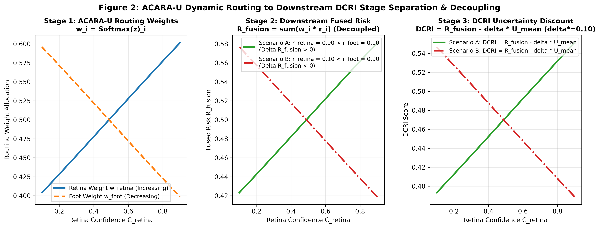

# Chapter 04: Boundary & Decoupling Analysis

## 1. Single-Modality Weight Invariance Analysis

In single-modality regimes (`R`, `F`, `C`), the active set contains exactly one element ($\lvert \mathcal{A} \rvert = 1$). Under the ACARA-U softmax formulation:

$$
w_i = \frac{\exp(z_i - z_i)}{\exp(z_i - z_i)} = \frac{\exp(0)}{\exp(0)} = 1.000000
$$

### Key Insights:
1. **Zero Derivative:** For $\lvert \mathcal{A} \rvert = 1$, $\frac{\partial w_i}{\partial C_i} = \frac{\partial w_i}{\partial U_i} = \frac{\partial w_i}{\partial Q_i} = \frac{\partial w_i}{\partial R_i} = 0.0$.
2. **Operational Meaning:** When only a single modality is available, the router cannot redistribute weight to alternative channels. It must allocate 100% of decision weight to the sole available modality regardless of its uncertainty or quality.
3. **Downstream Compensation:** While the router weight cannot adjust in single-modality encounters, downstream DCRI uncertainty penalization ($\text{DCRI} = R_{\text{fusion}} - \delta U_{\text{available}}$) discounts the final decision score, ensuring high uncertainty in single-modality encounters still triggers conservative policy behavior.

---

## 2. Decoupling of Router Weights and Downstream Fused Risk

A common misconception in multimodal fusion is that increasing a modality's confidence or weight must always increase the fused risk score. The mathematical relationship shows complete decoupling:

### 2.1 Derivation of Fused Risk Gradient
Let $R_{\text{fusion}} = \sum_{j \in \mathcal{A}} w_j r_j$. The derivative with respect to channel feature $x_i$ (where $x_i \in \{C_i, Q_i, R_i\}$) is:

$$
\frac{\partial R_{\text{fusion}}}{\partial x_i} = \sum_{j \in \mathcal{A}} r_j \frac{\partial w_j}{\partial x_i}
$$

For a two-modality active set $\mathcal{A} = \{1, 2\}$ with $w_1 + w_2 = 1 \implies \frac{\partial w_2}{\partial x_1} = -\frac{\partial w_1}{\partial x_1}$:

$$
\frac{\partial R_{\text{fusion}}}{\partial x_1} = r_1 \frac{\partial w_1}{\partial x_1} + r_2 \left(-\frac{\partial w_1}{\partial x_1}\right) = (r_1 - r_2) \frac{\partial w_1}{\partial x_1}
$$

### 2.2 Directional Cases
Since $\frac{\partial w_1}{\partial x_1} > 0$ for positive features ($C, Q, R$):
1. **Case 1 ($r_1 > r_2$):** $\frac{\partial R_{\text{fusion}}}{\partial x_1} > 0$ (Fused risk increases).
2. **Case 2 ($r_1 < r_2$):** $\frac{\partial R_{\text{fusion}}}{\partial x_1} < 0$ (Fused risk decreases).
3. **Case 3 ($r_1 = r_2$):** $\frac{\partial R_{\text{fusion}}}{\partial x_1} = 0$ (Fused risk unchanged).

This establishes that router weight monotonicity ($\partial w_1 / \partial x_1 > 0$) is an independent structural property that does not constrain the sign of downstream risk adjustments.

### 2.3 Stage Propagation & DCRI Consistency
When channel uncertainties $U_j$ are held constant during a confidence or weight perturbation test, $\text{DCRI} = R_{\text{fusion}} - \delta^* \bar{U}$ (with frozen $\delta^* = 0.10$) satisfies:

$$
\Delta \text{DCRI} = \Delta R_{\text{fusion}}
$$

This confirms downstream propagation consistency across stages (Router $\to$ Fused Risk $\to$ DCRI), while the isolated response to varying uncertainty penalties $\delta$ is separately certified in Volume 13.

---

## 3. Degenerate Fail-Closed Handling

When all modalities are missing ($A = \emptyset$), no meaningful logit kernel can be evaluated:
1. Masked logits all equal $-\infty$.
2. Naive softmax evaluation would yield indeterminate $\frac{0}{0} = \text{NaN}$.
3. ACARA-U explicitly intercepts $|\mathcal{A}| = 0$ before logit normalization, returning:
   - `status = "NO_MODALITY_AVAILABLE"`
   - `weights = {"retina": 0.0, "foot": 0.0, "clinical": 0.0}`
   - `num_active = 0`
4. This guarantees a fail-closed response, preventing uninitialized execution or NaN propagation.

---

## 4. Mutation Detection Audit

The verification test suite was subjected to 14 intentional fault injections across routing kernels, schema boundaries, and artifact consistency checks to confirm verifier sensitivity:

| Mutation Test Name | Fault Mechanism | Target Invariant / Boundary | Detection Gate |
| :--- | :--- | :--- | :---: |
| **`test_mutation_1`** | Inverted uncertainty sign ($+ \gamma U_i$) in router kernel | Uncertainty Monotonicity ($\frac{\partial w_i}{\partial U_i} > 0$) | Gate S15-04 |
| **`test_mutation_2`** | Inverted confidence sign ($-\alpha C_i$) in router kernel | Confidence Monotonicity ($\frac{\partial w_i}{\partial C_i} < 0$) | Gate S15-02 |
| **`test_mutation_3`** | Inactive channel weight leakage ($w_j > 0$) in `test_results.json` | Hard Availability Masking ($w_j = 0.0$) | Gate S15-07 |
| **`test_mutation_4`** | Tampered SHA-256 hash in `freeze_manifest.json` | Cryptographic Hash Integrity | Gate S15-00 |
| **`test_mutation_5`** | Corrupted frozen coefficient ($\alpha = 2.0$) in `protocol.json` | Configuration Integrity ($\Theta_0$) | Gate S15-01 |
| **`test_mutation_6`** | Missing `production_route_boundary_passed` field in results | Numerical Stability Contract | Gate S15-10 |
| **`test_mutation_7`** | Mutation count mismatch ($N=5 \neq 14$) in results | Mutation Suite Contract | Gate S15-15 |
| **`test_mutation_8`** | Malformed non-numeric string in numeric float field | Type-Safe Float Validation | Gate S15-06 |
| **`test_mutation_9`** | Summary status set to `FAILED` in `summary.json` | Cross-Artifact Status Consistency | Gate S15-00 |
| **`test_mutation_10`** | Summary phase set to `C11.14` in `summary.json` | Cross-Artifact Phase Consistency | Gate S15-00 |
| **`test_mutation_11`** | Summary `gates_passed` set to `14/15` in `summary.json` | Cross-Artifact Gate Count Consistency | Gate S15-00 |
| **`test_mutation_12`** | Null `artifact_hashes` dictionary in manifest | Root Schema Object Structure | Gate S15-00 |
| **`test_mutation_13`** | Root JSON list array instead of dictionary in `protocol.json` | Root JSON Schema Object Type | Gate S15-00 |
| **`test_mutation_14`** | Inverted criterion flag in scorecard contradicting results | Direct Cross-Artifact Scorecard Consistency | Gate S15-00 |
