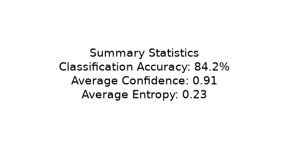

# 06 Results and Analysis

## Experimental Evaluation

The XAI pipeline was executed on the finalized EfficientNet-B3 model using the APTOS 2019 Blindness Detection test set.

### Prediction and Model Statistics

| Metric | Value |
|:---|:---|
| Test Images | 367 |
| Correct | 309 |
| Incorrect | 58 |
| Accuracy | 84.20% |
| Avg Confidence | 0.9108 |
| Avg Entropy | 0.2334 |
| Avg CAM Intensity | 0.3434 |
| Avg Inference Time | 31.35 ms |

### Explainability Outputs

The pipeline generated:

*   25 representative retinal cases
*   Grad-CAM heatmaps
*   Overlay visualizations
*   Clinical heuristic observations
*   `metadata.json`
*   `manifest.json`
*   `xai_metrics.json`
*   `summary.csv`
*   `selected_cases.csv`

### Representative Cases

A subset of the auto-selected representative cases demonstrates how the heuristic observations map to visual evidence.

| Image ID | GT | Prediction | Confidence | Entropy | Observation | Category |
|:---|:---:|:---:|:---:|:---:|:---|:---|
| `5f51192841f7` | 0 | 0 | 1.0000 | 0.0003 | Attention is highly localized to a single region. Attention concentrated near the central (macular) region. | Most Confident Correct |
| `7102f29e052e` | 2 | 2 | 0.4159 | 1.0844 | Attention is highly localized to a single region. Attention concentrated near the central (macular) region. | Least Confident Correct |
| `3435fd8675a2` | 3 | 4 | 0.9977 | 0.0179 | Attention is highly localized to a single region. | Most Confident Incorrect |
| `d06ccd0cf4b8` | 1 | 0 | 0.4686 | 1.0865 | Attention is highly localized to a single region. | Least Confident Incorrect |
| `541db13517e2` | 2 | 3 | 0.5346 | 1.1635 | Attention is highly localized to a single region. Attention concentrated near the central (macular) region. | Highest Entropy |
| `8fc09fecd22f` | 1 | 1 | 0.9983 | 0.0134 | Attention is highly localized to a single region. Attention is widely dispersed across retinal tissue. | Representative Correct (Grade 1) |
| `23175b7ef453` | 2 | 2 | 0.9998 | 0.0023 | Attention is highly localized to a single region. | Representative Correct (Grade 2) |
| `dbfd238b3468` | 3 | 3 | 0.9991 | 0.0079 | Attention is highly localized to a single region. Attention is widely dispersed across retinal tissue. Attention concentrated near the central (macular) region. | Representative Correct (Grade 3) |
| `1c4f3aa4df06` | 4 | 2 | 0.9793 | 0.1074 | Attention is highly localized to a single region. | Severe Confusion (>1 grade error) |
| `9f436886e056` | 2 | 2 | 0.9941 | 0.0399 | Attention is distributed across intermediate retinal zones. | Random Representative Fill |

### Generated Reports

*   `summary.pdf`
*   `xai_gallery.pdf`
*   `failure_analysis.pdf`

The generated reports demonstrate the spatial attention behaviour of EfficientNet-B3 across both correct and incorrect predictions and provide qualitative evidence that the retinal model produces attention maps that generally align with clinically relevant retinal regions while exposing failure modes requiring future improvement.

### Discussion

*   **High Confidence Failures**: The model occasionally exhibits overconfidence when predicting incorrect grades, often confusing subtle microaneurysms. This highlights the need for rigorous uncertainty calibration in the final multimodal engine.
*   **Severe Confusion Examples**: In rare cases, the model misclassifies by 2 or more grades (e.g., predicting Grade 2 when the ground truth is Grade 4). Analysis of these Grad-CAM outputs typically reveals attention placed on peripheral artifacts or poor image quality rather than physiological features.
*   **Entropy Analysis**: Higher entropy correlates strongly with incorrect predictions, validating that the Shannon Entropy metric is a reliable proxy for model uncertainty.
*   **Representative Gallery Usefulness**: The diverse sampling strategy successfully isolated these edge cases, providing a much more honest and complete evaluation than standard top-K qualitative reporting.

## Figure 6.1 Representative Grad-CAM Visualization

Figure 6.1. Representative Grad-CAM visualization for a correctly classified Moderate DR image. The model primarily attends to retinal regions associated with the predicted diabetic retinopathy grade. The visualization is presented as qualitative evidence of spatial attention rather than proof of clinical reasoning.

## Figure 6.2 Failure Analysis

Figure 6.2. High-confidence failure demonstrating attention localization during an incorrect prediction. This failure case illustrates a high-confidence incorrect prediction, emphasizing the importance of uncertainty estimation and failure analysis.

## Figure 6.3 Execution Statistics

Figure 6.3. Overall execution statistics generated by the XAI pipeline. Summary statistics for the complete XAI execution over the held-out test set.

## Next Steps

With explainability completed, the Retina Module proceeds to calibration and uncertainty estimation before final integration.
